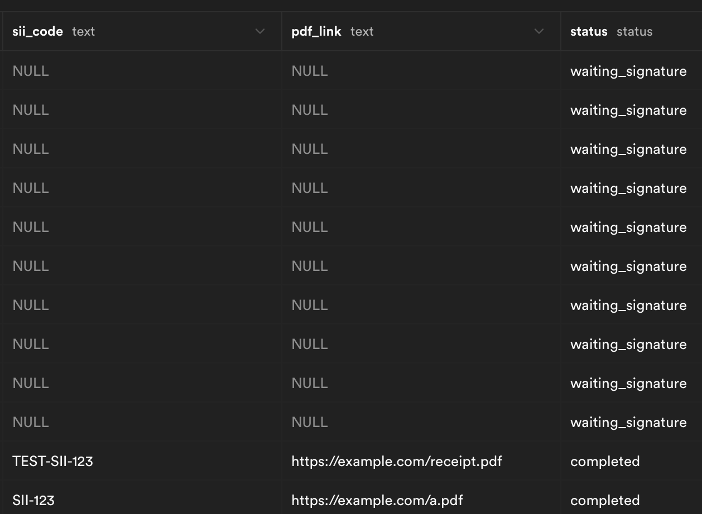

# carvuk-interview
Este readme explicará un resumen de lo implementad y la ejecución local del proyecto.

## Resumen
Se implementó casi todo lo pedido, el flujo de compra y de boletas, autentificación con Clerck estan completos. La validación de boletas con el SII no se encuentra funcionando completamente debido a problemas con el callback al usar ngrok (es primera vez que lo usaba). La lógica para que funcione está casi toda (se envia una request del frontend al backend, el cual se comunica con la api del sii, y este expone un endpoint de callback que correctamente acutaliza la bdd con la información recibida.) Sin embargo, aunque durante el desarrollo de la funcionalidad si me funcionaba el callback, 30 minutos antes de la entrega este paró de comunicarse con ngrok y no logré solucionarlo (manualmente, si se hace el request idéntico al que se hace desde el pipeline el callback actualiza bien). No alcancé a mostrar en el front la información recibida del SII (pdf_link y sii_code) pero si están en la bdd.



También hay un error al presionar rápidamente agregar producto, que lo duplica, que no alcancé a arreglar.

## Ejecución local

### Frontend
Se debe utilizar npm para instalar las dependencias y luego npm run dev para levantar el frontend.
```bash
npm install
npm run dev
```

Se deben incluir las siguiente variables de entorno en un archivo .env:

```bash
VITE_API_BASE="url del backend"
VITE_SUPABASE_URL="url de supabase"
VITE_SUPABASE_ANON_KEY="llave de supabase"
VITE_CLERK_PUBLISHABLE_KEY="llave de clerk"
CLERK_SECRET_KEY="secreto de clerk"

CLERK_SIGN_IN_URL="/sign-in"
CLERK_SIGN_IN_FALLBACK_REDIRECT_URL="/"
CLERK_SIGN_UP_FALLBACK_REDIRECT_URL="/"
```

### Backend
Se debe utilizar uv para instalar las dependencias y luego uv run uvicorn app.main:app --reload para levantar el backend.
```bash
uv install
uv run uvicorn app.main:app --reload
```

Para levantar ngrok se debe ejecutar el siguiente comando:
```bash
ngrok http 8000
```
Este comando generará una url de la forma https://<random-string>.ngrok-free.app. Esta es importante para el callback del SII.

Se deben incluir las siguiente variables de entorno en un archivo .env:
DATABASE_URL="URL de la base de datos que no se usa, pero que estaba seteada de antes para prepararse para la entrevista"
CALLBACK_URL="https://<random-string>.ngrok-free.app"
SII_API_URL =https://eol9cyu9z953tcx.m.pipedream.net/document-sii
SUPABASE_URL="url de supabase"
SUPABASE_KEY="llave de supabase"

## Contacto
Cualquier duda o problema, pueden contactarme a mi correo: bmarquezdelaplata@uc.cl